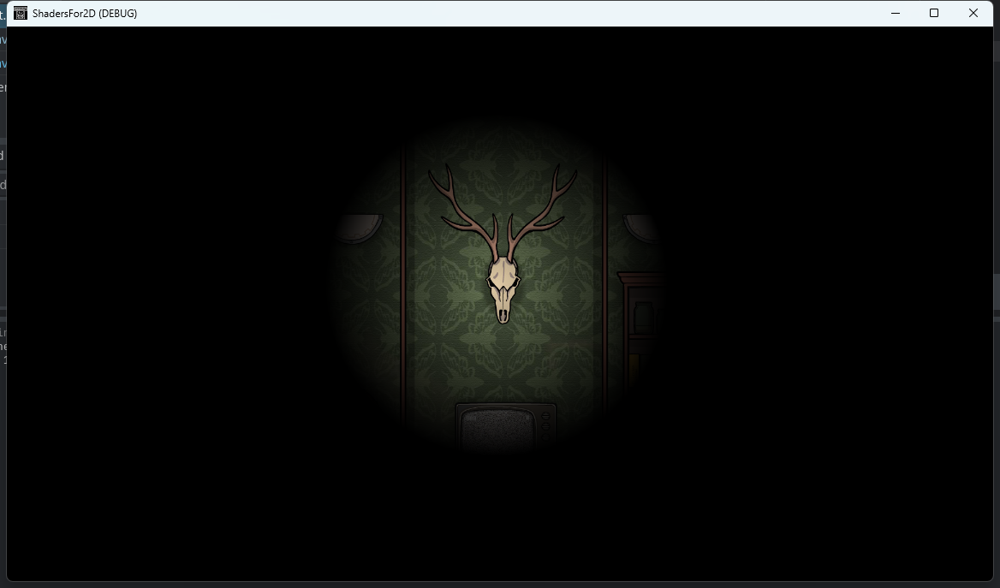

# Shader2D

2D Shader in Godot

| NAME | SCREENSHOT                     | NAME       | SCREENSHOT                       |
|:----:| ------------------------------ |:----------:|:--------------------------------:|
| wave |  | flashlight |  |
|      |                                |            |                                  |
|      |                                |            |                                  |
