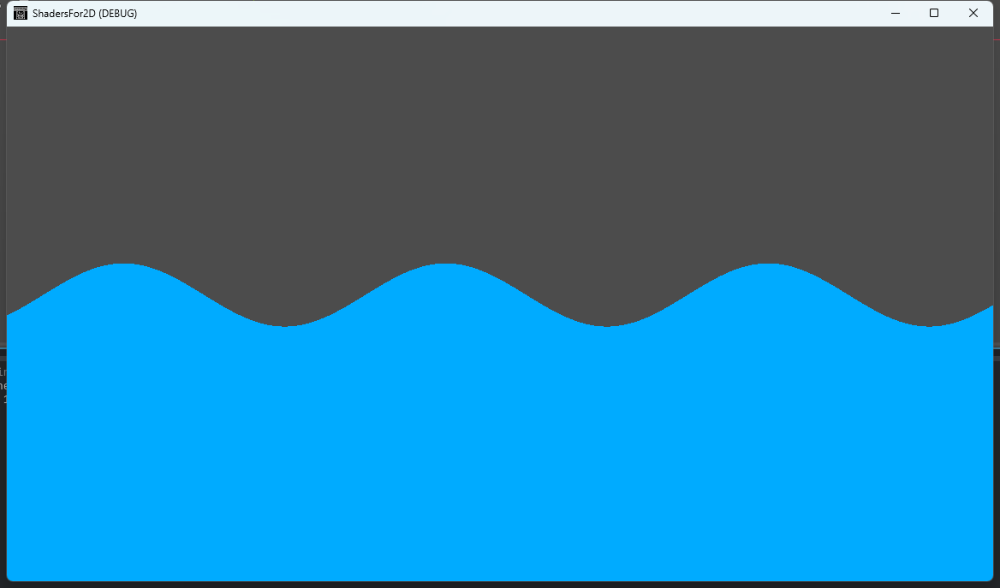
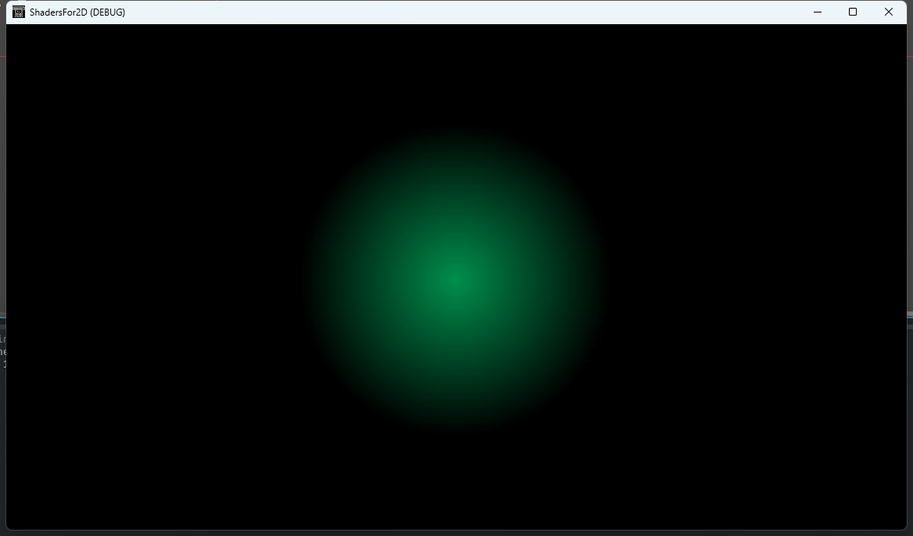

# ShadersFor2D

Shaders for 2D written using Godot

| NAME | SCREENSHOT                    | NAME       | SCREENSHOT                      |
|:----:| ----------------------------- |:----------:|:-------------------------------:|
| wave |  | flashlight |  |
|      |                               |            |                                 |
|      |                               |            |                                 |
