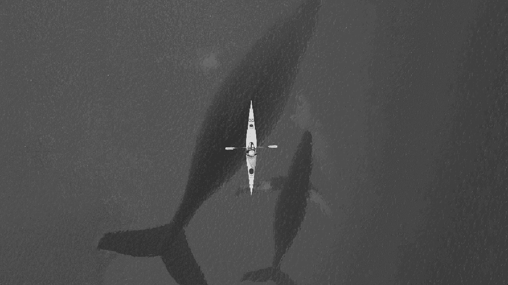
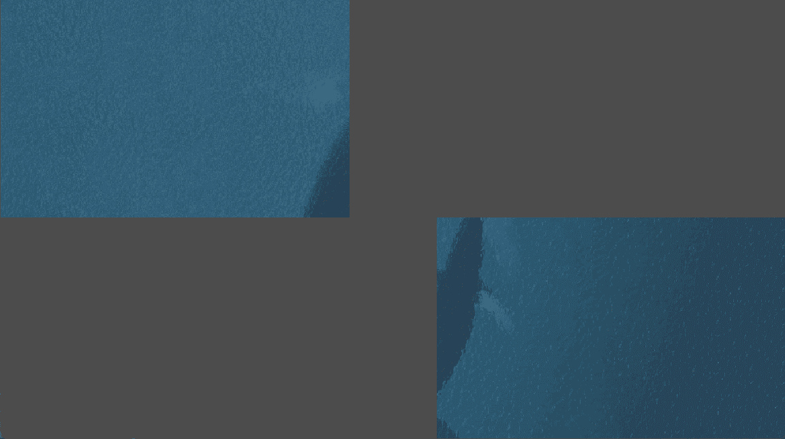

# Shader2D

2D Shader in Godot

## Environment

- Windows 11

- Godot 4.0.3

## Shaders

| NAME   | SCREENSHOT                       | NAME          | SCREENSHOT                              | NAME | SCREENSHOT                    | NAME | SCREENSHOT                     |
|:------:| -------------------------------- |:------:|:---------------------------------------:|:----:|:-----------------------------:|:----:|:------------------------------:|
| wave   |    | show   |           | CRT  |  | gray |  |
| spiral |  | ripple |  | knit |  | bar transition |  |
|        |                                  |        |                                         |      |                               |      |                                |
