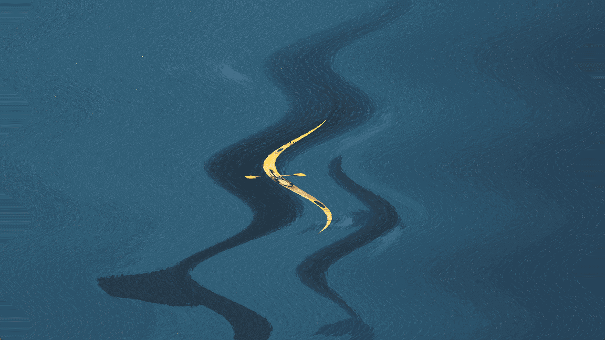

# Shader2D

2D Shader in Godot

## Environment

- Windows 11
- Godot 4.0.3

## Shaders

All shaders are gdshader-only files

| NAME   | SCREENSHOT                       | NAME     | SCREENSHOT                         | NAME  | SCREENSHOT                      | NAME           | SCREENSHOT                               |
|:------:| -------------------------------- |:--------:|:----------------------------------:|:-----:|:-------------------------------:|:--------------:|:----------------------------------------:|
| Wave   |    | Show     |      | CRT   |    | Gray           |            |
| Spiral |  | Ripple   |    | Knit  |   | Bar transition |  |
| B&W    |     | Pixelate |  | Swirl |  | Grid           |            |

## Executable

You can quickly check all the shaders by running this project

